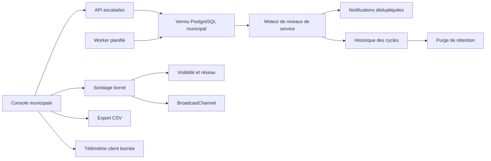

# Fermeture — Escalade citoyenne

## Statut

Le module est fermé fonctionnellement après intégration des PR A à F. Il couvre la détection des demandes à risque ou dépassées, les alertes dédupliquées, la planification, le lancement manuel, le verrouillage concurrent, l’historique, la rétention, le pilotage municipal et la robustesse client.

## Parcours utilisateur

1. Un gestionnaire ouvre **Cycles d’escalade**.
2. Il consulte les indicateurs, filtre l’historique et peut lancer un cycle manuel.
3. Si un cycle est déjà actif, l’interface passe en suivi automatique.
4. Le suivi se suspend si l’onglet est caché ou si le réseau est indisponible.
5. Le suivi reprend au retour et s’arrête lorsqu’un nouvel historique apparaît, lorsqu’un autre onglet signale la fin ou après expiration du délai maximal.
6. L’utilisateur peut exporter l’historique en CSV.

## Architecture

## Contrats principaux

- `POST /api/v1/municipal/citizen-requests/escalations/run`
- `GET /api/v1/municipal/citizen-requests/escalations/history?limit=25`
- conflit concurrent : `409 CITIZEN_ESCALATION_ALREADY_RUNNING`
- sources : `SCHEDULED`, `MANUAL`
- états d’exécution : `SUCCESS`, `FAILED`

## Robustesse

- verrou distribué par municipalité;
- garde client contre le double clic;
- suspension hors ligne et onglet caché;
- synchronisation multi-onglets;
- sondage toutes les trois secondes, arrêté après résultat ou délai maximal;
- nettoyage des timers et canaux au démontage;
- traitement indépendant des municipalités dans le worker.

## Expérience

- progression estimée plafonnée à 95 % avant résultat;
- durée attendue calculée à partir de l’historique;
- dernier cycle et prochaine exécution calculables;
- filtres persistants;
- export CSV;
- messages distincts succès, avertissement, erreur et chargement.

## Observabilité

Le client conserve un journal borné des transitions : démarrage, pause, reprise, fin, expiration, conflit et annulation. Le serveur conserve l’historique persistant avec volumes, durée et erreurs.

## Accessibilité

- erreurs annoncées avec `role=alert` et `aria-live=assertive`;
- autres états annoncés poliment;
- stratégie de focus vers le message ou le bouton de lancement;
- contrastes renforcés;
- libellés explicites des états.

## Tests

- tests unitaires par fonction;
- test transversal de fermeture A-D;
- tests des timers, conflits, filtres, CSV, télémétrie et accessibilité;
- tests backend existants pour API, verrouillage, planification, historique et rétention.

## Matrice de traçabilité

| Besoin | Mise en œuvre | Preuve |
|---|---|---|
| Ne pas perdre une demande en retard | niveaux de service et alertes | tests service/API |
| Éviter le spam | déduplication par demande, niveau et destinataire | tests d’escalade |
| Éviter deux cycles simultanés | verrou PostgreSQL municipal | test `409` |
| Comprendre les exécutions | historique persistant et indicateurs | tests historique |
| Fonctionner en conditions réelles | réseau, visibilité, multi-onglets, timeout | tests lifecycle/polling |
| Être utilisable au clavier et lecteur d’écran | rôles, annonces, focus, contraste | tests accessibilité |
| Garder des preuves sans croissance infinie | rétention configurable | tests rétention |

## Exploitation

Variables :

- `CITIZEN_ESCALATION_INTERVAL_MS`
- `CITIZEN_ESCALATION_RETENTION_DAYS`
- `CITIZEN_ESCALATION_RETENTION_INTERVAL_MS`

Le worker doit être lancé avec `npm run worker`. L’API seule ne démarre pas le planificateur.

## Limites acceptées

- la télémétrie de transitions client reste locale et bornée;
- la progression est une estimation, pas une mesure serveur en temps réel;
- le scénario navigateur complet pourra être ajouté lorsque l’infrastructure Playwright de ce dépôt sera standardisée.

## Décision de fermeture

Le module Escalade citoyenne peut être considéré fermé lorsque les PR #548 à #553 sont fusionnées dans l’ordre et que la branche finale est propagée dans `main`.
